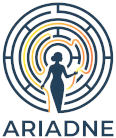

# Ariadne 

**Ariadne** is a Python toolkit to harmonize source vocabularies into the OHDSI Standardized Vocabularies.

It currently supports three workflows:

- **Conditions:** exact matching and hierarchy matching (for identifying a parent concept when no exact standard match is available).
- **Drugs:** prepares source codes for inserting into the OHDSI Boiler software as described [here](https://github.com/OHDSI/Vocabulary-v5.0/wiki/Community-contribution.-Drug-vocabularies).
- **Procedures:** exact source-to-standard concept mapping for procedure vocabularies.

The toolkit is designed to be extensible, allowing for the addition of new workflows (e.g., measurements, devices) and mapping strategies as needed.

## Features

* **Clean-up:** normalizes source terms per mapping rules, removing non-essential information.
* **Verbatim term mapping:** maps terms that (almost) exactly match standard concepts using normalization (lowercasing, punctuation removal, stemming).
* **Embedding vector search:** retrieves semantically similar standard concepts as mapping candidates.
* **LLM-assisted exact mapping:** selects the best standard concept from candidates.
* **Hierarchy matching (Conditions):** finds parent concepts for unmatched terms in the standard hierarchy.
* **Evaluation:** compares outputs against gold-standard mappings.